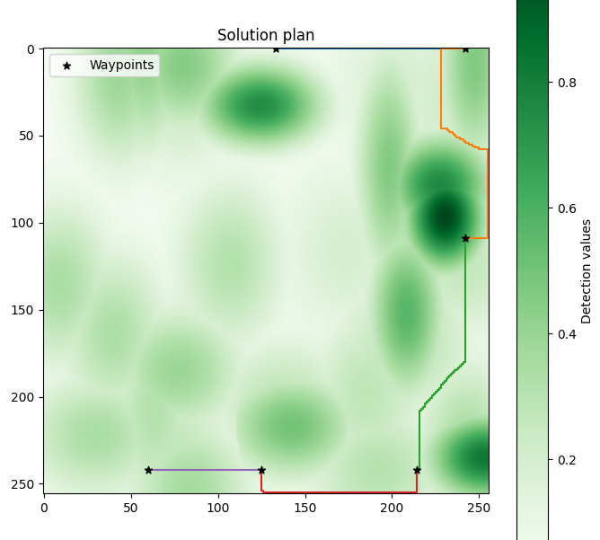

# Planificación de Rutas Evitando Radares

Inteligencia Artificial — UC3M

## Descripción

Proyecto de **búsqueda heurística sobre grafos** en el que un avión debe visitar una serie de puntos de interés (POIs) en un mapa geográfico minimizando el riesgo de ser detectado por radares situados aleatoriamente en el terreno.

El sistema modela:

- Un **mapa** discretizado en una rejilla, delimitado por unas coordenadas geodésicas (`Boundaries`).
- Uno o varios **radares** (`Radar`), cada uno con parámetros físicos propios (potencia de transmisión, ganancia de antena, longitud de onda, sensibilidad...) a partir de los cuales se calcula su alcance máximo y su **nivel de detección** en cada punto del mapa mediante una gaussiana bidimensional.
- Un **mapa de detección** que asigna a cada celda del terreno un coste proporcional a la probabilidad de ser detectado por algún radar.
- Un **grafo de adyacencia** construido sobre esa rejilla (movimientos arriba/abajo/izquierda/derecha), sobre el que se ejecuta un algoritmo de **búsqueda heurística** (tipo A*) para encontrar la ruta de menor coste que visite, en orden, todos los POIs.

## Estructura del repositorio

| Fichero | Descripción |
|---|---|
| `main.py` | Punto de entrada: carga el escenario, genera el mapa y los radares, ejecuta la búsqueda y muestra los resultados (gráficas de radares, mapa de detección y ruta solución). |
| `Map.py` | Clase `Map`: generación de radares, cálculo del mapa de detección. |
| `Radar.py` | Clase `Radar`: modelo físico del radar (alcance máximo, nivel de detección en un punto). |
| `Boundaries.py` | Clase `Boundaries`: límites geodésicos del mapa. |
| `Location.py` | Clase `Location`: coordenada geodésica (latitud/longitud). |
| `SearchEngine.py` | Construcción del grafo, heurísticas (`h1`, `h2`) y algoritmo de búsqueda de caminos (`path_finding`). |
| `scenarios.json` | Escenarios de prueba predefinidos (límites del mapa, tamaño de la rejilla, número de radares y POIs a visitar). |

> **Nota:** este repositorio corresponde a la base de la práctica proporcionada por la asignatura. Las funciones `Map.compute_detection_map`, `SearchEngine.build_graph`, `SearchEngine.discretize_coords`, `SearchEngine.path_finding`, `SearchEngine.h1` y `SearchEngine.h2` son las que se piden implementar como parte del ejercicio (búsqueda informada / heurísticas admisibles).

## Ejecución

```bash
pip install numpy matplotlib networkx tqdm
python main.py <nombre_escenario> <tolerancia>
```

Por ejemplo:

```bash
python main.py scenario_1 0.5
```


El programa mostrará por pantalla:
1. La posición de los radares dentro de los límites del mapa.
2. El mapa de detección resultante (zonas de mayor/menor riesgo).
3. La ruta solución encontrada, junto con el coste total y el número de nodos expandidos por la búsqueda.

## Tecnologías

- Python 3
- numpy, networkx, matplotlib, tqdm
